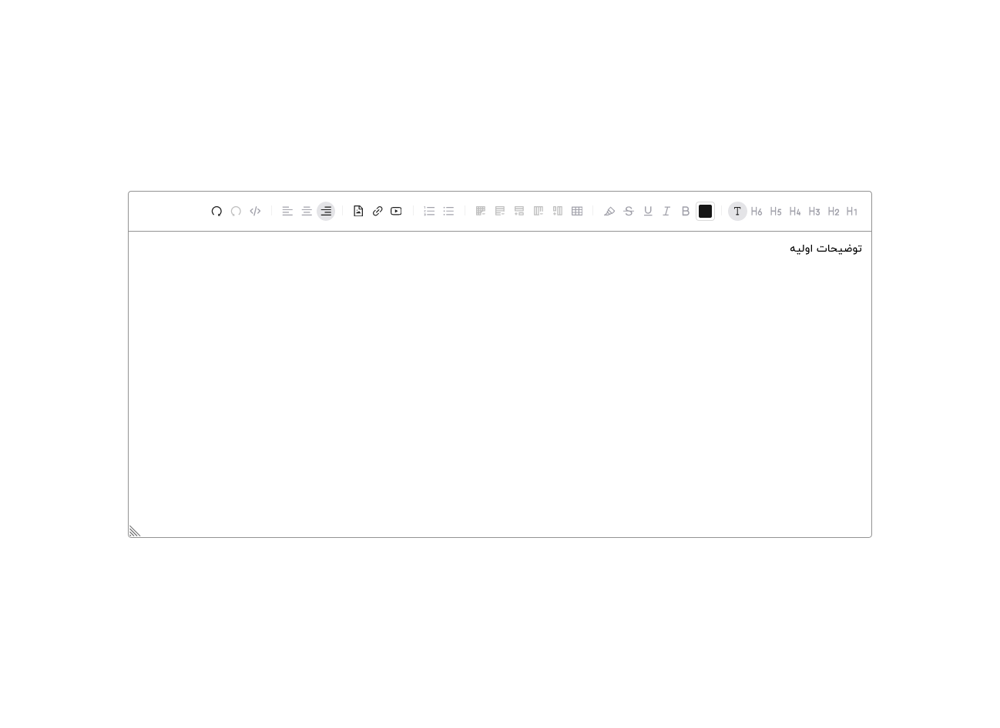

Discover how to create a sophisticated Rich Text Editor using React. This comprehensive guide covers essential features such as text formatting, embedding media, and handling user input effectively. Learn how to integrate third-party libraries, customize the editor's toolbar, and ensure a seamless user experience in your web applications. Perfect for developers looking to enhance their projects with dynamic text editing capabilities.

  To support me, please create
  <strong>Pull request</strong>
  and give <strong>star⭐</strong>
  to this repository.
   
  I appreciate your support in advance. ❤

&nbsp;
&nbsp;
&nbsp;
&nbsp;
&nbsp;

[Technologies](#-technologies) •
[Demo](#-demo) •
[Features](#-features) •
[Pages](#-pages) •
[Contributing](#-contributing) •
[Links](#-links)

## 🔧 Technologies

&nbsp;
&nbsp;

## ✨ Demo

You can visit and explore Rich Text Editor in the [Rich Text Editor](https://rich-text-editor-fa.vercel.app/) template.

## 🔥 Features

- Using React Typescript Vite
- Using Ant Design with plugins
- Using Tiptap editor
- Using Tailwind with Postcss
- Using Clsx with Tailwind Merge
- Linting with Eslint and Stylelint
- Format with Prettier
- Husky and Lint-staged for Pre-committing

## 📃 Pages

- Home (index)
- Not Found

(<a href="#top">BACK TO TOP 🔝</a>)

## 🤝 Contributing

Contributions are what make the open source community such an amazing place to learn, inspire, and create. Any contributions you make are **greatly appreciated**.

If you have a suggestion that would make this better, please fork the repo and create a pull request. You can also simply open an issue with the tag "enhancement".
Don't forget to give the project a star! Thanks again!

1. Fork the Project
2. Create your Feature Branch (`git checkout -b feature/AmazingFeature`)
3. Commit your Changes (`git commit -m 'Add some AmazingFeature'`)
4. Push to the Branch (`git push origin feature/AmazingFeature`)
5. Open a Pull Request

## 🔗 Links

  
  
  

(<a href="#top">BACK TO TOP🔝</a>)

